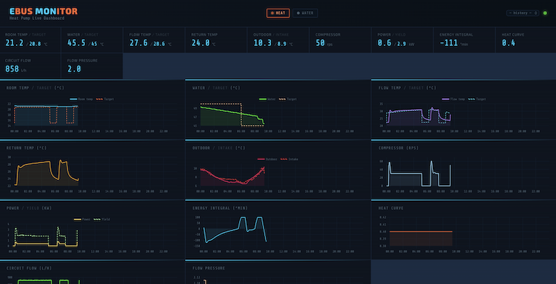
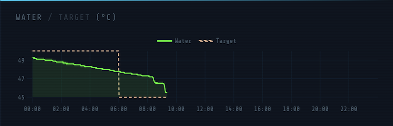

# eBUS Heat Pump Live Dashboard



A live monitoring dashboard for eBUS heat pumps. It connects to a running
[ebusd](https://github.com/john30/ebusd) instance, polls your heat pump's sensors
every few seconds, and streams the data to a browser dashboard in real time.
You can configure the charts that you would like to see in `config.yaml`.

---

## Prerequisites

- **uv** — a fast Python package manager ([install instructions](https://docs.astral.sh/uv/getting-started/installation/))
- **ebusd or micro-ebusd** already running and reachable on your network,
  with your heat pump's message definitions loaded

> **What is ebusd?**
> [ebusd](https://github.com/john30/ebusd) is a daemon that talks to your
> heat pump over the eBUS serial interface and exposes its data over TCP.
> [micro-ebusd](https://token.ebusd.eu) is an ebusd implementation that's
> fully embedded on a specialized ebus adapter.

---

## Getting started

### 1. Get the code

```bash
git clone https://github.com/stgm/ebusmon.git
cd ebusmon
```

### 2. Edit the config file

Open `config.yaml` and set the address of your ebusd:

```yaml
ebusd:
  host: 127.0.0.1   # ← your ebusd IP address
  port: 8888            # default ebusd TCP port, usually unchanged
```

That's the minimum you need to change to get started. The rest of the config
controls which fields are displayed, and some nice defaults are included.

### 3. Run the dashboard

```bash
uv run app.py
```

`uv` will make sure that dependencies are installed into the `.venv` directory.
Then the server starts running.
Now open your browser at **http://localhost:6789** (or replace `localhost` with the
machine's IP if you're running it on a different server).

You can point to a different config file with `--config`:

```bash
uv run app.py --config /path/to/my-config.yaml
# or short form:
uv run app.py -c /path/to/my-config.yaml
```

---

## Configuring charts

All chart configuration lives in `config.yaml`. You do not need to touch `app.py`.

### How charts are defined

Each entry under `charts:` becomes one chart panel and one KPI tile in the header.
The format is:

```yaml
charts:
  - Display name: FieldName, min_bound, max_bound
```

Example:

```yaml
  - Flow temp: FlowTemp, -5, 90
```

This creates a chart labelled **"Flow temp"** for the `FlowTemp` ebusd field,
with outlier correction applied for values outside −5 … 90.

### Bounds and outlier correction

`min_bound, max_bound` define the physically realistic range for that field.
Any reading outside this range is assumed to be a glitch and is silently
replaced by interpolation between the surrounding good values
(up to two consecutive bad readings are corrected).

Omit the bounds if you don't need outlier correction:

```yaml
  - Heat curve: HeatCurve
```

### Pairing two fields on one chart

Put two entries under the same dash (`-`) — the first is the primary (left axis),
the second is secondary (shown dimmer, used for comparison):

```yaml
  - Water: HwcTemp, 5, 80
    Target: TargetTempHwc, 10, 80
```

This shows DHW temperature and its target setpoint on the same chart.



### Optional log field name

You can provide a custom snake_case key for internal logging, placed between
`FieldName` and the bounds:

```yaml
  - Return temp: RunDataReturnTemp, return_temp, -5, 80
```

If omitted, the key is derived automatically from the display name.

### Non-ebus RoomTemp

There is one special case variable. If you do not have a room thermostat
in your system, the room temperature will not be available on the eBus.
Hence, the app will accept room temperatures at a special URL.

```bash
curl -X POST http://localhost:6789/roomtemp \
     -d "current=20.5"
```

For example, it's possible to have Apple Homekit send a room temperature
to the dashboard every so many minutes.

### Field names

The `FieldName` part must match what ebusd calls the message. This is 
part of the ebusd configuration. The example config uses common variable
names, but if any data is missing, your might want to check whether
the ebusd config calls it differently.

---

## Indicators

The indicators in the page header light up when configurable conditions are
met. Each indicator has a name and a set of conditions that must all be true
simultaneously.

```yaml
indicators:
  - Heat:
      ThreeWayValve: heat           # field value contains "heat" (case-insensitive)
      RunDataCompressorSpeed: "on"  # numeric field value is > 0
```

Two condition types:
- **String match** — the field's string value contains the given text (case-insensitive)
- **`"on"`** — the field's numeric value is greater than zero

---

## How it works

1. On startup, we load all message definitions from ebusd and resolve
   your configured field names.
      - Fields not found in ebusd are skipped with a warning in the console.
2. A background loop polls all configured fields every 15 seconds.
3. Readings are averaged per minute and written to `data/YYYY-MM-DD.jsonl`
   for persistence. Today's file is restored into memory on startup so the
   full day is visible immediately.
4. The browser receives live updates via Server-Sent Events (SSE) — a
   persistent HTTP connection where the server pushes data as it arrives.
   The page auto-reconnects if the connection drops.
5. At midnight the in-memory data rolls over automatically and the browser
   resets all charts for the new day.

Historical days are available via the date picker in the top-right corner.

---

## Troubleshooting

**No data appears / fields show "—"**
Check the console output when starting the app. Lines like:
```
[pyebus] WARNING: fields not found in msgdefs: {'flowtemp', ...}
```
mean ebusd doesn't know that field name.

**"Failed to connect" on startup**
The app can't reach ebusd. Check that the `host` and `port` in `config.yaml`
are correct and that ebusd is running. You can test with:
```bash
nc -zv 192.168.1.100 8888
```

**Outlier spikes in charts**
Tighten the `bounds` for that field in `config.yaml`. The current bounds may
be too wide to catch the glitches your heat pump produces.
